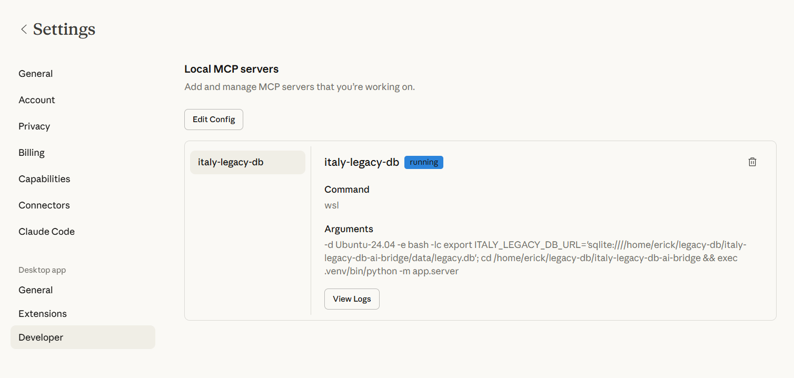
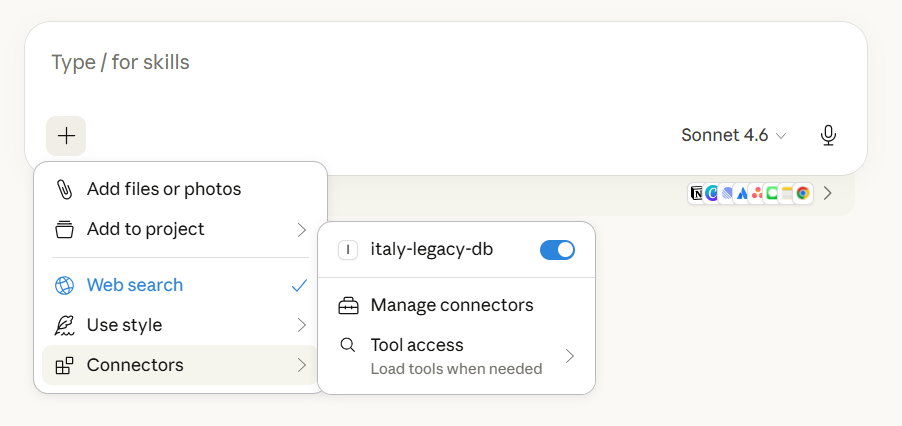
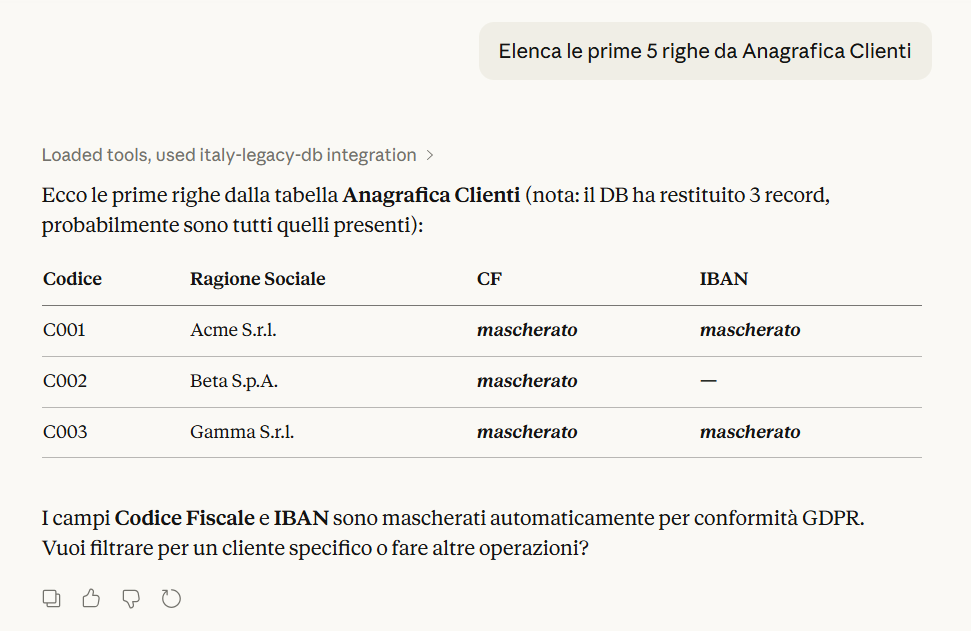
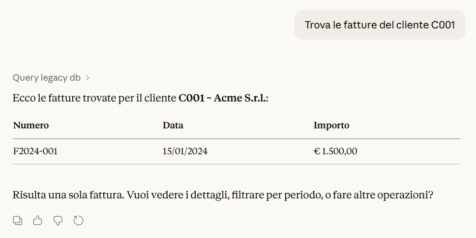
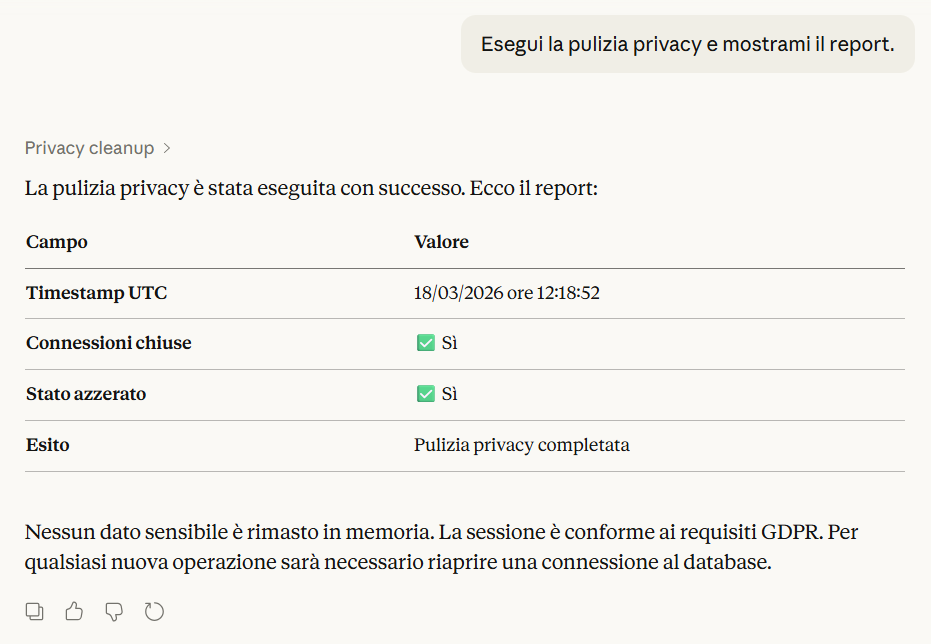

# Italy Legacy DB AI Bridge: Enterprise MCP Template per ERP Italiani

[](https://www.impesud.it) [](https://www.anthropic.com/claude) [](https://modelcontextprotocol.io) [](https://www.python.org/) [](config/mapping.json) [](https://www.microsoft.com/sql-server) [](https://www.ibm.com/it-infrastructure/power/ibm-i) [](docs/SECURITY_GDPR.md) [](https://www.impesud.it)

**Italy Legacy DB AI Bridge** è un template professionale basato sullo standard **Model Context Protocol (MCP)** per integrare in sicurezza assistenti AI (Claude, Cursor) con database gestionali legacy e sistemi ERP italiani (AS/400, SQL Server, SAP, Oracle). 

Il bridge implementa un layer **read-only** con mapping semantico e mascheramento automatico dei dati sensibili, garantendo la piena conformità **GDPR** per le aziende.

### 🌟 Perché scegliere MCP per l'integrazione Enterprise?
L'approccio **MCP** (Model Context Protocol) è lo standard di settore per esporre tool e risorse ad assistenti AI in modo strutturato. Rispetto all'accesso diretto al database, offre:
* **Controllo Granulare**: L'AI interagisce solo tramite tool predefiniti (`query_legacy_db`) e non ha accesso "raw" allo schema.
* **Sicurezza GDPR**: Include **PII Masking** nativo per Codice Fiscale, Partita IVA e IBAN.
* **Astrazione Semantica**: Mappa nomi tabelle fisiche criptiche (es. `T_041CLI`) in entità di business chiare (es. `Anagrafica_Clienti`).
* **Minimizzazione dei Dati**: Invia all'LLM solo i record necessari, riducendo drasticamente i rischi di data leakage.

---

### 🗺️ Configurare il mapping semantico (`config/mapping.json`)

Il file [`config/mapping.json`](config/mapping.json) definisce **quali entità di business** sono visibili all’AI e a quali **tabelle fisiche** del gestionale corrispondono.

Esempio tipico per un ERP:

```json
{
  "tables": {
    "Anagrafica_Clienti": "T_041CLI",
    "Anagrafica_Fornitori": "T_042FOR",
    "Fatture": "T_105FTT",
    "Ordini": "T_210ORD",
    "Articoli": "T_030ART",
    "Magazzino": "T_050MAG"
  }
}
```

- Le **chiavi** (`Anagrafica_Clienti`, `Fatture`, …) sono i nomi “parlanti” che Claude userà nei tool.
- I **valori** (`T_041CLI`, `T_105FTT`, …) sono i nomi effettivi delle tabelle nel gestionale.

Suggerimenti pratici:
- Parti dalle entità che già usi nei report (clienti, fatture, ordini, magazzino).
- Mantieni il mapping come **whitelist** di ciò che vuoi davvero esporre all’AI.
- Se hai mapping diversi per ambienti (test/produzione), usa `ITALY_LEGACY_MAPPING_PATH=/path/to/mapping.json`.

---

### 🚀 Installazione e Quickstart

1.  **Clone e Installazione**:
    ```bash
    pip install -e ".[dev,odbc]"
    ```
2.  **Configurazione Ambiente**:
    Configura la stringa di connessione nel file `.env`:
    `ITALY_LEGACY_DB_URL="sqlite:///./data/legacy.db"`
3.  **Avvio Server**:
    ```bash
    python -m app.server
    ```

---

### 🔌 Configurazione Integrazioni (Claude & Cursor)

L'integrazione permette di trasformare Claude o Cursor in un operatore esperto sui tuoi dati aziendali, visualizzando dati mascherati e report di pulizia direttamente in chat.

#### Guida Completa: Integrazione Claude Desktop
Per attivare il bridge su Claude Desktop, aggiungi la configurazione al file `claude_desktop_config.json` (solitamente in `%AppData%\Roaming\Claude`):

```json
{
  "mcpServers": {
    "italy-legacy-db": {
      "command": "python",
      "args": ["-m", "app.server"],
      "env": {
        "ITALY_LEGACY_DB_URL": "tua_connection_string_qui"
      }
    }
  }
}
```
👉 **Documentazione dedicata**: [docs/CLAUDE_DESKTOP_WINDOWS.md](docs/CLAUDE_DESKTOP_WINDOWS.md)

#### Utilizzo con Cursor
Per integrare il bridge in Cursor, accedi alle impostazioni **Preferences > Cursor Settings > Tools & MCP**, clicca su "+ Add New MCP Server" e configura come segue:
- **Name**: `Italy Legacy Bridge`
- **Type**: `command`
- **Command**: `python -m app.server` (assicurati che l'ambiente virtuale sia attivo).

In alternativa, è già presente un modello su [.cursor/mcp.json.example](.cursor/mcp.json.example)

---

### 📸 Risultati in Claude

Di seguito alcuni screenshot che mostrano il bridge in uso con Claude: configurazione, connettore attivo, interrogazioni su tabelle mappate e report del tool di privacy cleanup.

| Configurazione / Connettore MCP | Interrogazione tabelle | Report privacy cleanup |
|---------------------------------|------------------------|------------------------|
|   |   |  |

---

### 🧩 Tool MCP Esposti
* **`query_legacy_db`**: Esegue interrogazioni sicure su tabelle mappate. I risultati vengono processati in tempo reale per mascherare PII (Codice Fiscale/IBAN).
* **`privacy_cleanup`**: Chiude i pool di connessione, resetta lo stato interno e genera un report di conformità sessione (timestamp, stato azzerato, esito).

### 🔒 Sicurezza e Compliance
* **Accesso Read-Only**: Forzato a livello di driver per impedire qualsiasi alterazione dei dati.
* **Anti-SQL Injection**: Parametrizzazione obbligatoria di ogni filtro di ricerca.
* **Privacy "No Retention"**: Tool dedicato per l'azzeramento della memoria di sessione dopo l'uso, con report verificabile dall'utente.

---

### 📂 Risorse e Documentazione
* 📑 [Guida Integrazione Claude Desktop](docs/CLAUDE_DESKTOP_WINDOWS.md)
* 🛡️ [Sicurezza & GDPR Compliance](docs/SECURITY_GDPR.md)

---

### 📄 Licenza

Proprietà Intellettuale di **[Impesud](https://www.impesud.it)** (Source-Available). Vedi [LICENSE](LICENSE).

---

### 📬 Contatti

* **Sito**: [impesud.it](https://www.impesud.it)
* **Email**: [amministrazione@impesud.it](mailto:amministrazione@impesud.it)
* Per richieste commerciali, supporto o informazioni sulla licenza: [Contatti Impesud](https://www.impesud.it/contatti/) o via email.